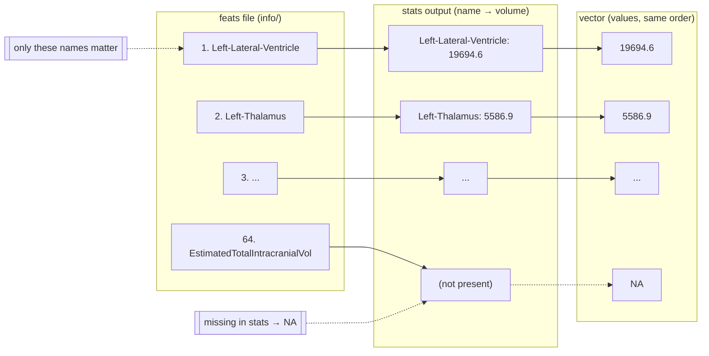
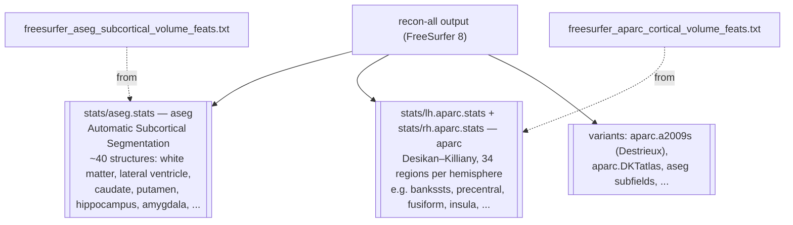
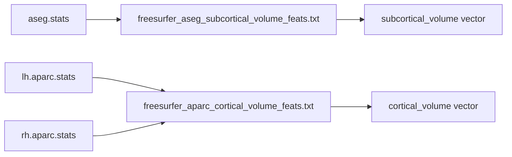
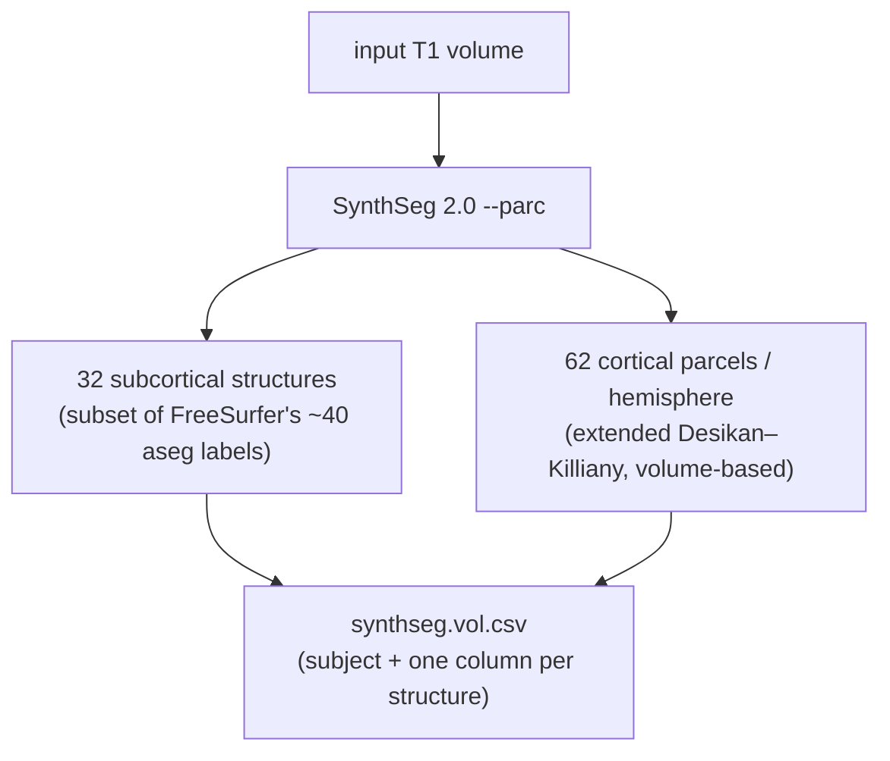
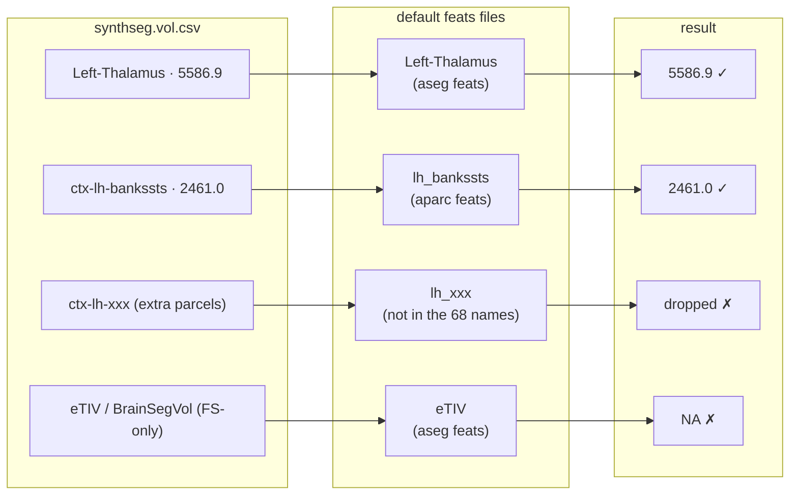

# Atlas & Stats Vector Reference (defaults)

Three things explained with diagrams: the default feature lists, the FreeSurfer atlases they
come from, and what SynthSeg actually outputs.

---

## 1. Default feats lists

Each stats vector type has a default atlas, and each atlas has a **feats file** that defines
the vector's feature names and order:

| stats vector type | default atlas | feats file (in `info/`) | features |
|---|---|---|---|
| `subcortical_volume` | `freesurfer_aseg` | `freesurfer_aseg_subcortical_volume_feats.txt` | 64 |
| `cortical_volume` | `freesurfer_aparc` | `freesurfer_aparc_cortical_volume_feats.txt` | 68 |
| `cortical_thickness` | `aparc` | `aparc_cortical_thickness_feats.txt` | 68 |

The vector is built 1:1 from the feats file — every feature gets one value from the stats
output; anything missing is filled with `NA`:



- `freesurfer_aseg_subcortical_volume_feats.txt` (64) — mirrors FreeSurfer `aseg.stats`:
  the standard subcortical structures + summary measures (`BrainSegVol`, `eTIV`,
  `CortexVol`, ...).
- `freesurfer_aparc_cortical_volume_feats.txt` (68) — 34 `lh_*` + 34 `rh_*` Desikan–Killiany
  region names, from FreeSurfer `lh.aparc.stats` / `rh.aparc.stats`.

---

## 2. Default FreeSurfer atlases

FreeSurfer's own stats files carry atlas names directly:



| atlas name | what it is | regions | stats file |
|---|---|---|---|
| `aseg` | Automatic Subcortical Segmentation | ~40 bilateral structures | `aseg.stats` |
| `aparc` | Desikan–Killiany cortical atlas | 34 per hemisphere | `lh.aparc.stats`, `rh.aparc.stats` |
| `aparc.a2009s` | Destrieux cortical atlas | 74 per hemisphere | `lh.aparc.a2009s.stats`, ... |

Mapping to the default feats:



---

## 3. SynthSeg output

The FS8 **volume** pipeline runs `synthseg 2.0 --parc` — no surface reconstruction.



SynthSeg's names look like:

```
subcortical:  Left-Thalamus, Left-Caudate, ...            (aseg-style)
cortical:     ctx-lh-bankssts, ctx-lh-precentral, ...     (DK-style, ctx-lh/rh- prefix)
```

How SynthSeg output fills the **default** feats lists (via `normalize_volumes.py`):



Rules of thumb:

- **Cortical:** only the 34 classic DK regions per hemisphere overlap between SynthSeg
  (62/hemi) and the aparc feats (34/hemi); SynthSeg's extra 28 parcels per hemisphere are
  ignored.
- **Subcortical:** the 32 SynthSeg structures map onto the aseg names; FreeSurfer-only
  summary measures (`eTIV`, `BrainSegVol`, ...) don't exist in SynthSeg output → `NA`
  (that's the recurring "29/64 missing" warning).
- **Volumes differ by definition:** SynthSeg counts voxels per parcel; FreeSurfer surface
  aparc computes pial−white geometric volume (Σ vertex area × thickness). Same names,
  different numbers.